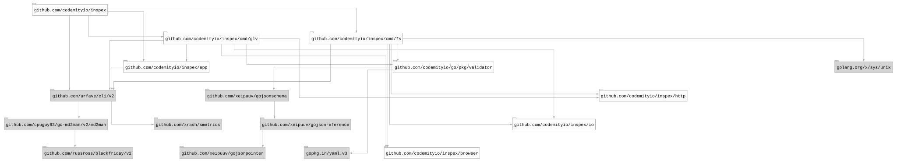

# 


## Table of contents

- [Summary](#summary)
- [Installation](#installation)
- [Usage](#usage)
  - [Manual](#manual)
  - [Subcommands](#subcommands)
  - [Docker](#docker)
- [Development](#development)
- [Packages](#packages)
- [Dependencies](#dependencies)
  - [Graph](#graph)
  - [Licenses](#licenses)
- [License](#license)

## Summary

A collection of command-line tools for the codebase analysis.

## Installation

To install the package, run `make install` (directly from the repository clone) or use
`go install github.com/codemityio/inspex@latest`.

## Usage

Once installed, use the `inspex` command to get started.

### Manual

``` bash
$ inspex --help
NAME:
   inspex - A new cli application

USAGE:
   inspex [global options] command [command options]

VERSION:
   latest

DESCRIPTION:
   A collection of command-line tools for the codebase analysis.

AUTHOR:
   codemityio

COMMANDS:
   fs       
   glv      
   help, h  Shows a list of commands or help for one command

GLOBAL OPTIONS:
   --help, -h     show help
   --version, -v  print the version

COPYRIGHT:
   codemityio
```

### Subcommands

- [`fs`](cmd/fs/README.md) - A tool for scanning and analysing the file system.
- [`glv`](cmd/glv/README.md) - A tool for scanning and analysing the git log.

### Docker

``` bash
docker rum codemityio/inspex
```

## Development

To work with the codebase, use `make` command as the primary entry point for all project tools.

Use the arrow keys `↓ ↑ → ←` to navigate the options, and press `/` to toggle search.

## Packages

## Dependencies

### Graph



### Licenses

| Package                                 | Licence                                                                             | Type         |
|-----------------------------------------|-------------------------------------------------------------------------------------|--------------|
| github.com/codemityio/go/pkg/validator  | https://github.com/codemityio/go/blob/v0.0.7/LICENSE                                | MIT          |
| github.com/cpuguy83/go-md2man/v2/md2man | https://github.com/cpuguy83/go-md2man/blob/v2.0.7/LICENSE.md                        | MIT          |
| github.com/russross/blackfriday/v2      | https://github.com/russross/blackfriday/blob/v2.1.0/LICENSE.txt                     | BSD-2-Clause |
| github.com/urfave/cli/v2                | https://github.com/urfave/cli/blob/v2.27.7/LICENSE                                  | MIT          |
| github.com/xeipuuv/gojsonpointer        | https://github.com/xeipuuv/gojsonpointer/blob/4e3ac2762d5f/LICENSE-APACHE-2.0.txt   | Apache-2.0   |
| github.com/xeipuuv/gojsonreference      | https://github.com/xeipuuv/gojsonreference/blob/bd5ef7bd5415/LICENSE-APACHE-2.0.txt | Apache-2.0   |
| github.com/xeipuuv/gojsonschema         | https://github.com/xeipuuv/gojsonschema/blob/v1.2.0/LICENSE-APACHE-2.0.txt          | Apache-2.0   |
| github.com/xrash/smetrics               | https://github.com/xrash/smetrics/blob/686a1a2994c1/LICENSE                         | MIT          |
| golang.org/x/sys/unix                   | https://cs.opensource.google/go/x/sys/+/v0.45.0:LICENSE                             | BSD-3-Clause |
| gopkg.in/yaml.v3                        | https://github.com/go-yaml/yaml/blob/v3.0.1/LICENSE                                 | MIT          |

## License

This project is licensed under the MIT License. See the [LICENSE](LICENSE) file for details.
